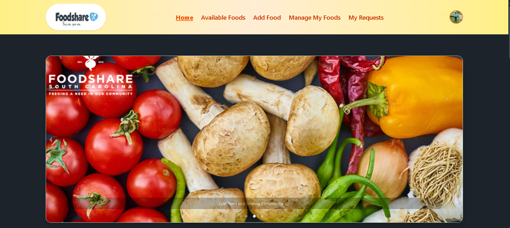

<!DOCTYPE html>
<html lang="en">
<head>
  <meta charset="UTF-8">

</head>
<body>

  <h1>🍱 Food Sharing Website</h1>
  
A community-driven platform that helps reduce food waste by allowing users to share and request surplus food within their local area.

  

  <h2>🌐 Live Demo</h2>
  
👉 <a href="https://foodsharing-34cc3.web.app/" target="_blank">Click here to visit the live site</a>

  

   <h2>📸 Screenshot</h2>
  

  <h2>🛠️ Tech Stack</h2>
  <ul>
    <li><strong>Frontend:</strong> React, Tailwind CSS, DaisyUI, React Router DOM</li>
    <li><strong>State & Data:</strong> TanStack React Query, Axios</li>
    <li><strong>Authentication:</strong> Firebase Authentication</li>
    <li><strong>Backend:</strong> Node.js, Express</li>
    <li><strong>Database:</strong> MongoDB (Mongoose ODM)</li>
  </ul>

  

  <h2>🔑 Key Features</h2>
  <ul>
    <li>🔍 Browse all food items with search & sort by expiration date</li>
    <li>📝 Detailed view for each food item</li>
    <li>🔐 Protected routes and Firebase user authentication</li>
    <li>➕ Add food with quantity, expiry, location, and notes</li>
    <li>📩 Request food via modal form</li>
    <li>📋 Manage personal listings and requests</li>
    <li>📱 Fully responsive UI with modern design</li>
    <li>⚡ Fast and efficient data fetching with React Query</li>
  </ul>

  

  <h2>📦 Major Dependencies</h2>
  <pre><code>
"react"
"react-router-dom"
"axios"
"@tanstack/react-query"
"firebase"
"tailwindcss"
"daisyui"
"react-helmet-async"
"express"
"mongoose"
"cors"
"dotenv"
  </code></pre>

  

  <h2>🚀 Run Locally</h2>
  
<strong>Client Side:</strong>

  <pre><code>
git clone https://github.com/your-username/food-sharing-client.git
cd food-sharing-client
npm install
npm run dev
  </code></pre>

  
<strong>Server:</strong>

  <pre><code>
git clone https://github.com/your-username/food-sharing-server.git
cd food-sharing-server
npm install
npm start
  </code></pre>

  

  <h2>🔗 Relevant Links</h2>
  <ul>
    <li>🔴 <strong>Live Website:</strong> <a href="https://foodsharing-34cc3.web.app" target="_blank">https://foodsharing-34cc3.web.app</a></li>
    <li>💻 <strong>Frontend GitHub Repo:</strong> <a href="https://github.com/tasnimulhasan873/b11a11-client-side-tasnimulhasan873" target="_blank">b11a11-client-side-tasnimulhasan873</a></li>
    <li>🛠 <strong>Backend GitHub Repo:</strong> <a href="https://github.com/tasnimulhasan873/food-sharing-server" target="_blank">food-sharing-server</a></li>
  </ul>

</body>
</html>

